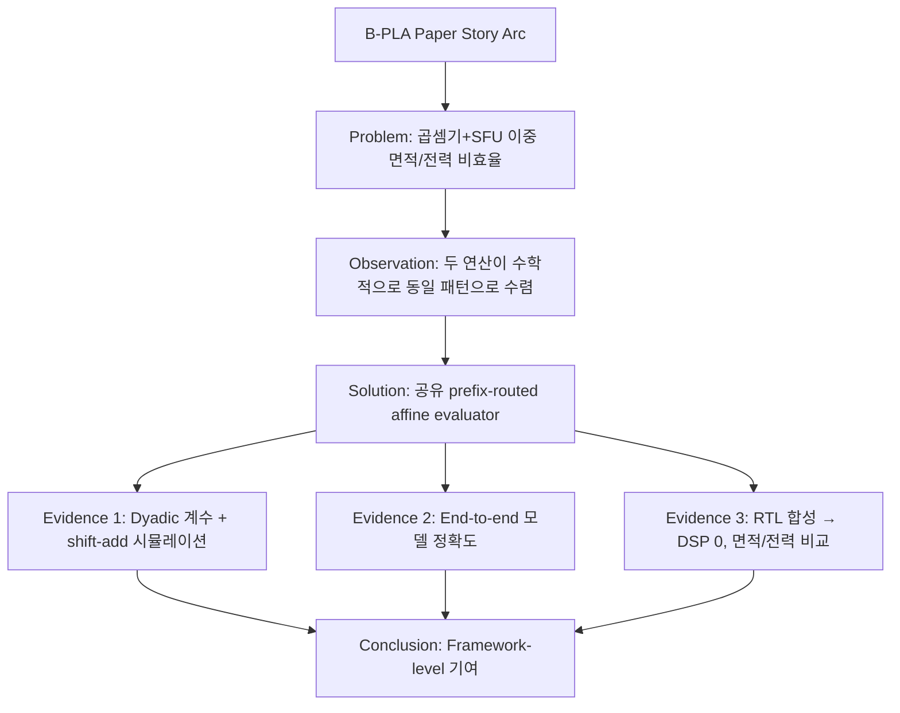

# B-PLA Framework 신규성(Novelty) 종합 평가 보고서

## 결론 요약

> [!IMPORTANT]
> **B-PLA는 "조건부 신규성(Conditional Novelty)"을 가진다.**
> 개별 구성요소는 선행 연구에 의해 상당 부분 선점되어 있으나, **세 가지 요소의 통합 조합**은 기존 문헌에서 발견되지 않는 고유한 아키텍처적 기여이다. 단, 이 신규성이 방어 가능하려면 **하드웨어 구현 증거**가 반드시 뒤따라야 한다.

---

## 1. 평가 대상 정리

B-PLA(Bit-Prefix Piecewise Linear Approximation)는 다음 세 가지 핵심 모듈로 구성된다:

| 모듈 | 설명 |
|------|------|
| **곱셈기 모듈** | FP32 가수부 크로스텀 `M₁×M₂`를 2D prefix-routed affine tile로 근사 |
| **활성화 모듈** | FP32 비트필드(S, E, M prefix) 직접 추출로 1D affine 세그먼트 라우팅 |
| **통합 아키텍처** | 위 두 모듈을 하나의 공유 dyadic shift-add affine evaluator에서 시분할 처리 |

---

## 2. 구성요소별 신규성 판정

### 2.1 B-PLA 곱셈기 — ❌ 신규성 낮음 (Not Novel ~ Partially Novel)

**판정 근거:**

| 선행 연구 | 중첩되는 B-PLA 요소 |
|-----------|---------------------|
| **ApproxLP** (DAC 2019) | 가수부 곱셈면을 선형 평면으로 분할하여 덧셈/시프트로 변환 |
| **PAM** (IEEE TC 2022) | 조각선형 근사 FP 곱셈기, 구성형(configurable) 다단계 정밀도 |
| **HAM** (IEEE TVLSI 2025) | 가수부 3D 서피스를 타일별 선형 피팅 + **PoT 계수로 shift-add 전환** |

특히 **HAM**은 B-PLA 곱셈기의 핵심 메커니즘인 "가수부 크로스텀 → 타일 분할 → dyadic 계수 → shift-add 연산"과 거의 완벽하게 중첩된다. B-PLA가 "2D mantissa-prefix 비트 슬라이싱을 통한 O(1) 주소 생성"이라는 미세한 구현 차이를 가지지만, 이것만으로 독립적인 신규성을 주장하기는 어렵다.

> [!CAUTION]
> **절대 피해야 할 클레임**: "We propose a novel piecewise-linear approximate floating-point multiplier"
> 이런 수준의 광범위한 주장은 ApproxLP/PAM/HAM에 의해 즉시 반박된다.

---

### 2.2 B-PLA 활성화 모듈 — ⚠️ 부분적 신규성 (Partially Novel)

**판정 근거:**

| 선행 연구 | 중첩 영역 | B-PLA의 차별점 |
|-----------|-----------|----------------|
| **ML-PLAC** (IEEE TCAS-I 2022) | PWL + shift-add 무곱셈기 활성화 | 고정소수점 전제, 정규화 필요 |
| **Flex-SFU** (IEEE TCAD 2025) | FP 입력 지원 + 비균일 PWL 활성화 | **BST 비교기 회로** 기반 세그먼트 탐색 |
| **Generic HW** (ICCE-TW 2024) | 다중 활성화 통합 + CSD shift-add | 활성화 도메인에만 국한 |

**B-PLA 활성화 모듈의 고유 포인트:**

```
FP32 비트스트림 → Sign(1b) ∥ Clamp(E)(nb) ∥ Prefix(M)(kb) → 정적 접합(concatenation) → 세그먼트 주소
```

이 **"comparator-less, branch-free O(1) 정적 비트필드 슬라이싱 프런트엔드"**는 기존 활성화 가속기(특히 Flex-SFU의 BST 비교기 회로)와 명확히 구별된다:

- Flex-SFU: 비균일 breakpoint → 하드웨어 이진탐색 트리 → 비교기 체인 → **면적/지연 오버헤드**
- B-PLA: 균일 prefix 기반 → 비트 슬라이싱 → 배선 레벨 주소 생성 → **O(1) 고정 지연, 비교기 0개**

이 라우팅 방식 자체는 신규성을 주장할 수 있는 포인트이나, 백엔드(shift-add affine evaluation)는 ML-PLAC과 본질적으로 동일하다.

---

### 2.3 통합 아키텍처 — ✅ 가장 유망한 신규성 (Most Promising Novelty)

**판정 근거:**

기존 선행 연구 7건을 분석한 결과:

```
                           곱셈 근사    활성화 근사    통합 공유 평가기
ApproxLP (2019)               ●            ✗              ✗
PAM (2022)                    ●            ✗              ✗
HAM (2025)                    ●            ✗              ✗
ML-PLAC (2022)                ✗            ●              ✗
Flex-SFU (2025)               ✗            ●              ✗
Generic HW (2024)             ✗            ●              ✗
Unified Smooth Act (2026)     ✗            ●              ✗
────────────────────────────────────────────────────────────
B-PLA                         ●            ●              ● ← 유일
```

> [!NOTE]
> **핵심 발견**: 곱셈과 활성화를 **하나의 prefix-routed affine evaluator**로 통합 처리하는 아키텍처는 조사된 선행 문헌 어디에도 존재하지 않는다.

이 통합이 가능한 수학적 근거:

```
곱셈 경로:  M₁×M₂ ≈ a_ij·M₁ + b_ij·M₂ + c_ij    (2D prefix routing → 3계수 affine)
활성화 경로: f(x) ≈ α_i·x + β_i                    (1D prefix routing → 2계수 affine)
```

두 경로 모두 **"prefix route → coefficient LUT read → dyadic shift-add affine evaluation"** 패턴으로 수렴하며, 동일한 물리 하드웨어(shifter, adder tree, LUT)에서 모드 스위칭으로 처리 가능하다.

---

## 3. 종합 신규성 매트릭스

| 평가 축 | 판정 | 비고 |
|---------|------|------|
| 조각선형 근사 곱셈 | ❌ Not Novel | ApproxLP, PAM, HAM 선점 |
| Dyadic/PoT 계수 shift-add 평가 | ❌ Not Novel | HAM, ML-PLAC 선점 |
| PWL 활성화 가속 | ❌ Not Novel | ML-PLAC, Flex-SFU 등 선점 |
| Training-free 연산자 대체 | ❌ Not Novel | 근사 컴퓨팅 분야 보편적 프로토콜 |
| FP32 비트필드 정적 슬라이싱 라우팅 | ⚠️ Partially Novel | Flex-SFU 대비 비교기 제거 |
| 2D prefix tile indexing for 크로스텀 | ⚠️ Partially Novel | HAM 대비 미세한 주소생성 차이 |
| **곱셈 + 활성화 통합 공유 평가기** | ✅ **Novel** | 선행 문헌 미발견 |
| **Framework-level 통합 아키텍처** | ✅ **Novel** | 이종 연산 도메인 단일화 |

---

## 4. 신규성이 방어 가능한 조건

> [!WARNING]
> B-PLA의 통합 아키텍처 신규성은 **현재 "이론적 수준"에 머물러 있다**. 현재 구현은 Python 수준의 floating-coefficient 프로토타입이며, 핵심 주장의 하드웨어 실현 가능성이 아직 검증되지 않았다.

### 신규성이 방어 가능해지려면 반드시 필요한 것들:

```
┌─────────────────────────────────────────────────────────────┐
│  1. Dyadic 계수 양자화 구현                                    │
│     → 현재 unconstrained float 계수 → PoT/dyadic 제한 필수     │
│                                                              │
│  2. Shift-add-only 시뮬레이션                                  │
│     → 실제 곱셈 없이 shift+add만으로 동작함을 코드로 증명        │
│                                                              │
│  3. End-to-end 모델 정확도                                     │
│     → ResNet/ViT 등에서 1% 이내 정확도 손실 곡선               │
│                                                              │
│  4. RTL 합성 증거                                             │
│     → DSP/multiplier block 0개 사용 확인                       │
│     → 면적/전력 비교: PAM, HAM, Flex-SFU 대비                  │
│                                                              │
│  5. 공유 평가기의 실질적 이점 정량화                             │
│     → 별도 유닛 설계 대비 면적/전력 절감률                       │
└─────────────────────────────────────────────────────────────┘
```

---

## 5. 최종 판단

### 한 줄 결론
> **B-PLA는 "조합적 신규성(Combinatorial Novelty)"을 보유한다. 개별 부품은 알려져 있지만, 그 조합 방식 자체가 새롭다.**

### 상세 판단

| 질문 | 답변 |
|------|------|
| B-PLA가 완전한 형태로 선행 문헌에 존재하는가? | **아니오** — 세 모듈의 동시적 통합은 미발견 |
| B-PLA의 개별 구성요소가 이미 알려져 있는가? | **예** — 대부분 선점됨 |
| 논문화 가능한 수준의 기여인가? | **조건부 예** — 하드웨어 증거가 뒷받침되어야 |
| 특허 방어가 가능한가? | **조건부 예** — 통합 아키텍처 + FP32 비트필드 라우팅 클레임에 한정 |

### 권장 프레이밍

```
❌ 약한 프레이밍 (회피):
"We propose a novel approximate multiplier and activation approximator"

✅ 강한 프레이밍 (권장):
"B-PLA is a training-free arithmetic replacement framework that unifies
FP multiplication and nonlinear activation under a bit-prefix-routed,
multiplierless affine evaluation primitive, enabling shared hardware
datapath reuse across heterogeneous arithmetic domains in ANN inference."
```

### 논문 구조 전략



---

## 6. 즉각적 연구 우선순위

> [!TIP]
> 현재 상태에서 신규성을 가장 빨리 강화할 수 있는 순서:

1. **🔴 긴급** — `modules/dyadic.py` 구현: 계수를 PoT/dyadic으로 양자화
2. **🔴 긴급** — Shift-add-only 평가 경로 구현 및 정확도 비교
3. **🟡 중요** — PyTorch 연산자 대체 → 소형 모델 end-to-end 정확도 측정
4. **🟡 중요** — 에너지 모델 확장: 활성화 모듈 포함, 공유 vs 별도 비교
5. **🟢 선택** — RTL 프로토타입 (Verilog shift-add evaluator)

---

> **최종 요약**: B-PLA의 가장 강력한 무기는 개별 근사 기법이 아니라, **"이종 연산 도메인의 기하학적 통일"**이라는 아키텍처 수준의 추상화이다. 이 추상화가 실제 하드웨어에서 면적/전력 이점으로 이어진다는 것을 증명하면, 방어 가능한 독자적 기여가 된다.
